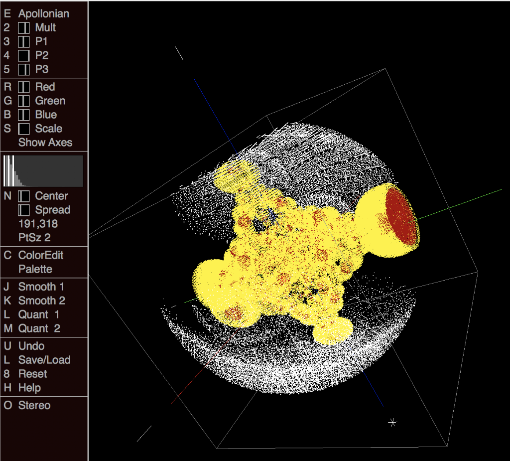

# OSX-MandelBulb
Collection of fractals render as a point cloud for the Mac.

Trying many experiments to figure put why this app is so much slower than the IOS rendition ( https://github.com/Kosalos/MandelBulb2 ).

For now I have commented put the 'adjacent shader' \
(which removed cloud points that were completely surrounded, hoping to make the image less dense and features more descernible).

Any help would be greatly appreciated.

